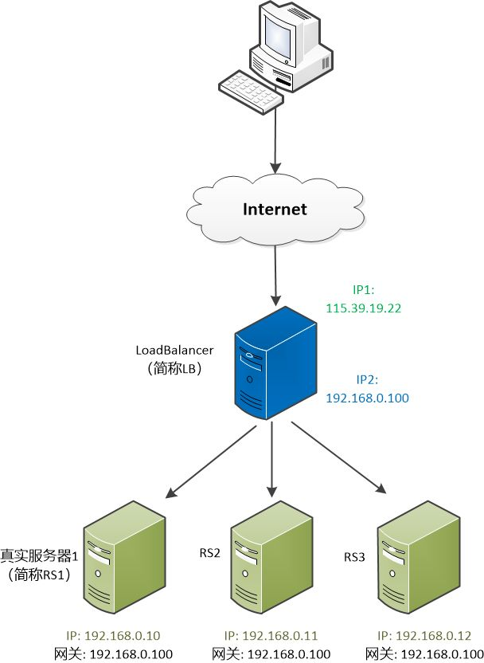

# **Load Balancing Script Usage Guide**
## **Overview**
This Python script is part of a load balancing problem, which is _**a common issue in distributed computing where work is distributed
among multiple computers or servers**_ to achieve optimal resource utilization, minimize response time, and avoid overload.
Specifically, this script is part of a project that aims to find the optimal schedule for cloud load balancing to keep a service
running in the cloud at reasonable cost by _**reducing the expense of running cloud servers**_ while _**minimizing risk and human time 
due to migrating**_ and _**doing balance sleeping models across servers**_.

<center>

</center>

### The objective function:
- `number_of_active_servers`: Minimize the total cost of running servers
- `number_of_migrations`: Minimize the total cost of migrating users from one server to another to reduce the risk and human time
- `max_sleeping_workload`: Minimizing the upper bound of the number of sleeping process on each server to balance the sleeping process across servers

_p.s.: These three objectives are combined into one objective function by order of importance in distributed computing._
### The constraints:
- The number of processes running on each server must less than max_process_per_server
- Each user is assigned to exactly one server and this server must be active
- The number of processes sleeping on each server must less than max_sleeping_workload
### The decision variables:
- `assign_user_to_server_vars`: assign_user_to_server[i,j] = 1 if user i is assigned to server j, 0 otherwise
- `active_var_by_server`: active_servers[j] = 1 if server j is active, 0 otherwise
## **Requirements**
- Python 3.10 or later
- docplex module 2.25.236 or later
You can install the required Python module using pip or conda, you should notice that by this method, the module will be community version.
    ```bash
    conda install docplex==2.25.236
    ```
## **How to Use**
1. Ensure you have the necessary Python version and modules installed.
2. Run the script using Python:
    ```bash
    python load_balancing.py
    ```
The script will print the solution to the console and also save it as a JSON file named `solution.json`.
## **Customization**
The script uses predefined data for the servers and users. If you want to use your own data, you can modify the `SERVERS` and `USERS` variables in the script.
The `SERVERS` variable is a list of server names. The `USERS` variable is a list of tuples, where each tuple represents a user and contains the user's ID, the number of running processes, the number of sleeping processes, and the current server.

For example:
```python
SERVERS = ["server1", "server2", "server3"]

USERS = [("user1", 2, 1, "server1"),
         ("user2", 0, 2, "server1"),
         ("user3", 0, 4, "server2")]
```
This represents a scenario with three servers and three users. User1 is currently on server1 and has 2 running processes and 1 sleeping process. User2 is also on server1 but has no running processes and 2 sleeping processes. User3 is on server2 and has no running processes and 4 sleeping processes.
